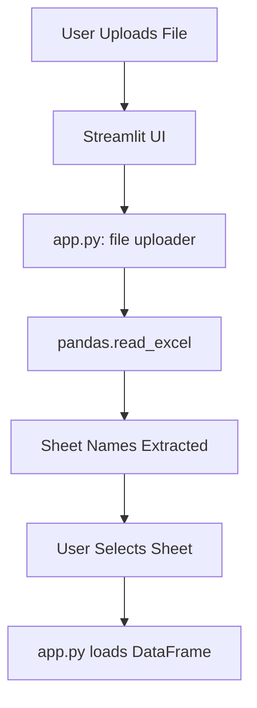
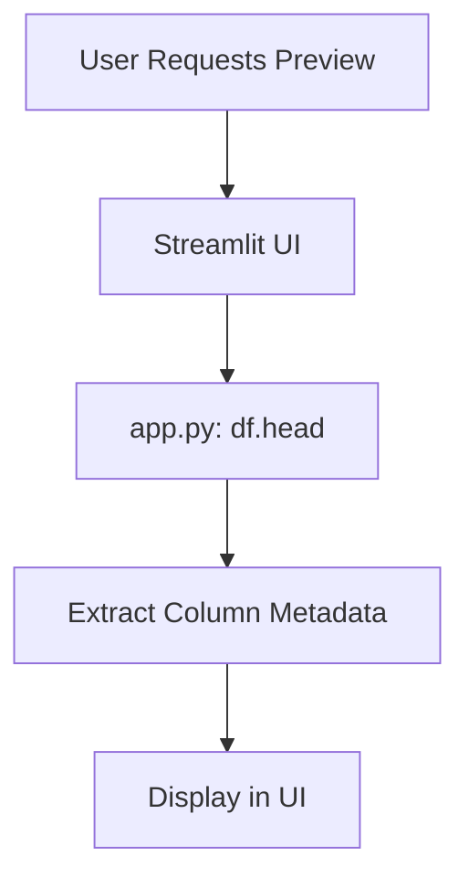
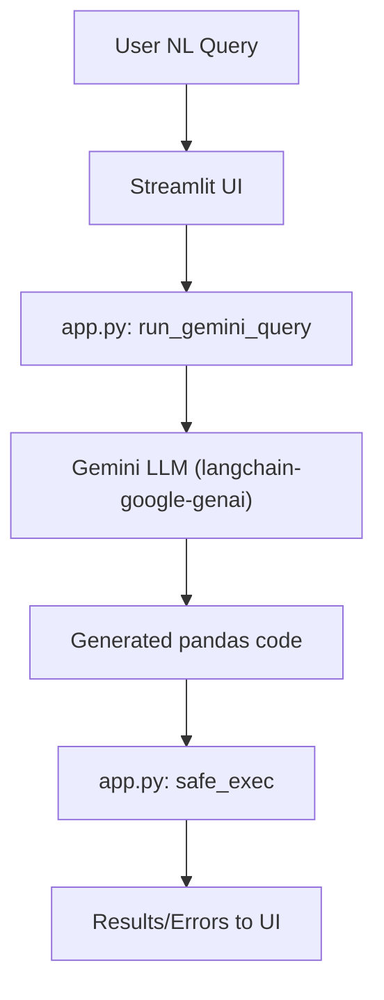
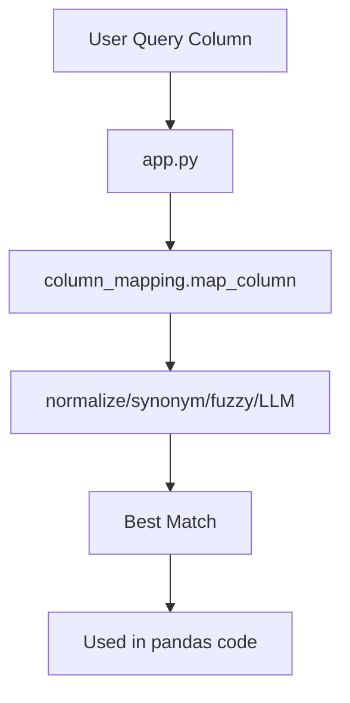
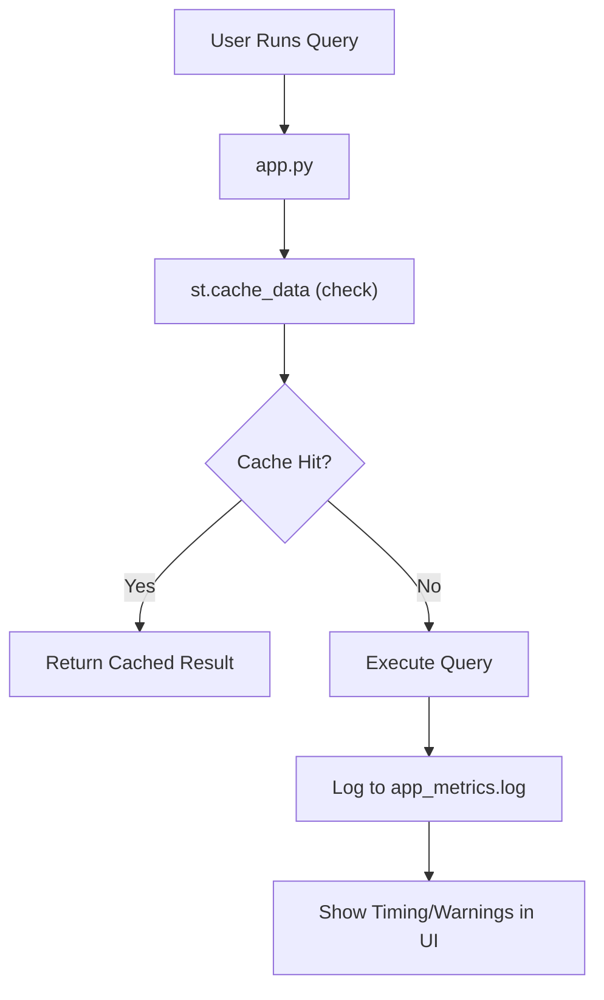
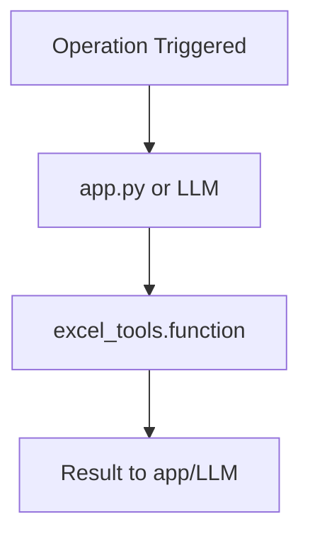

# 📈 Application Flow: Excel Sheets Agent

This document describes what happens in the background for each major user action, including which APIs and functions are called. Each flow is shown both as a step-by-step arrow diagram and as a Mermaid flowchart.

---

## 1. Excel File Upload & Sheet Selection

**Step-by-step:**
1. User uploads Excel file via Streamlit UI
2. `app.py` calls `pandas.read_excel` (with openpyxl engine)
3. Sheet names are extracted and displayed
4. User selects a sheet
5. `app.py` loads selected sheet into DataFrame

**Arrow Diagram:**
User Uploads File -> Streamlit UI -> app.py (file uploader) -> pandas.read_excel -> Sheet Names Extracted -> User Selects Sheet -> app.py loads DataFrame

**Mermaid:**

---

## 2. Data Preview & Column Analysis

**Step-by-step:**
1. User views preview in Streamlit
2. `app.py` slices DataFrame (e.g., `df.head(50)`)
3. Column metadata extracted (types, nulls, etc.)
4. Displayed in UI

**Arrow Diagram:**
User Requests Preview -> Streamlit UI -> app.py (df.head) -> Extract Column Metadata -> Display in UI

**Mermaid:**

---

## 3. Natural Language Query Execution

**Step-by-step:**
1. User enters NL query in Streamlit
2. `app.py` calls `llm_utils.run_gemini_query` with query and context
3. Gemini LLM (via langchain-google-genai) generates pandas code
4. `app.py` (safe_exec) executes code on DataFrame
5. Results/errors shown in UI

**Arrow Diagram:**
User NL Query -> Streamlit UI -> app.py (run_gemini_query) -> Gemini LLM (langchain-google-genai) -> Generated pandas code -> app.py (safe_exec) -> Results/Errors to UI

**Mermaid:**

---

## 4. Column Mapping Intelligence (Phase 4)

**Step-by-step:**
1. User query references a column
2. `column_mapping.map_column` called with user input and available columns
3. Tries normalization, synonym, fuzzy, then LLM mapping
4. Returns best match and method
5. Used in pandas code generation/execution

**Arrow Diagram:**
User Query Column -> app.py -> column_mapping.map_column -> (normalize/synonym/fuzzy/LLM) -> Best Match -> Used in pandas code

**Mermaid:**

---

## 5. Caching, Logging, and Performance Monitoring (Phase 6)

**Step-by-step:**
1. User runs a query
2. `app.py` checks `@st.cache_data` for cached result
3. If not cached, executes query, times duration
4. Logs event to `app_metrics.log`
5. Displays timing and warnings in UI

**Arrow Diagram:**
User Runs Query -> app.py -> st.cache_data (check) -> (if miss) -> Execute Query -> Log to app_metrics.log -> Show Timing/Warnings in UI

**Mermaid:**

---

## 6. Tooling and Worksheet Operations (Phase 3)

**Step-by-step:**
1. LLM or user triggers a worksheet operation (filter, aggregate, sort, pivot)
2. `excel_tools.py` function called
3. Returns DataFrame/result to app or LLM

**Arrow Diagram:**
Operation Triggered -> app.py or LLM -> excel_tools.<function> -> Result to app/LLM

**Mermaid:**

---

# End of Flow Documentation
